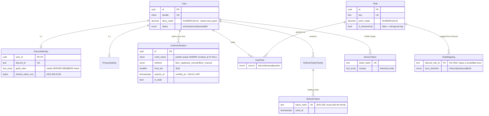
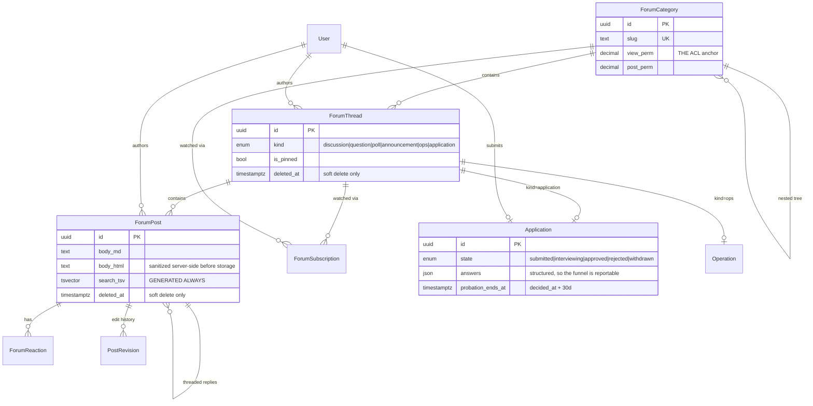
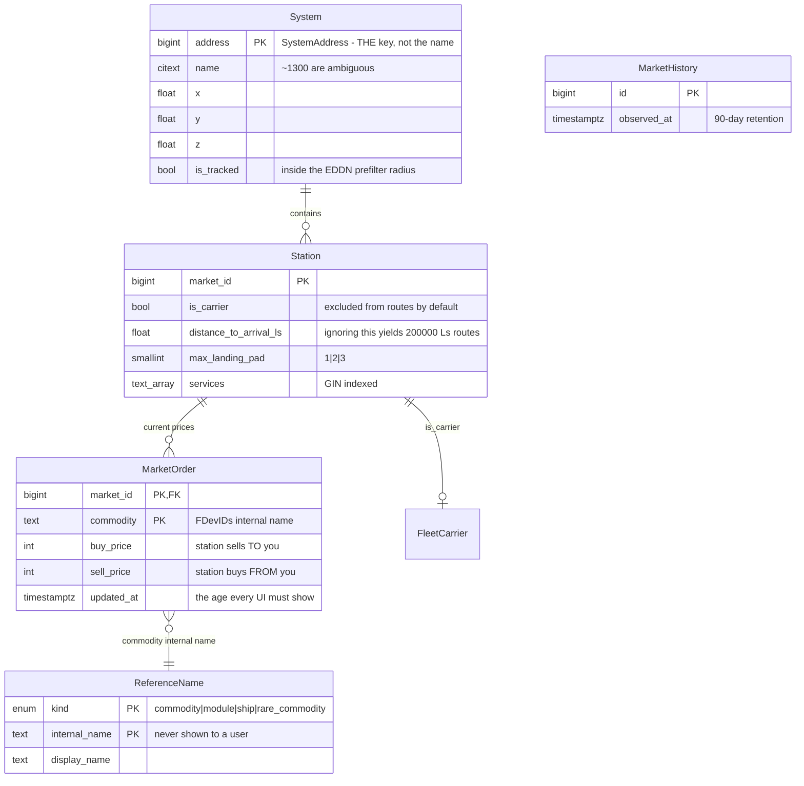
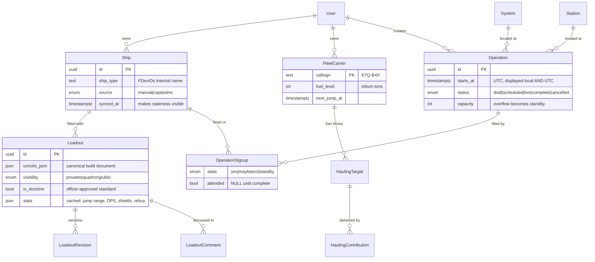
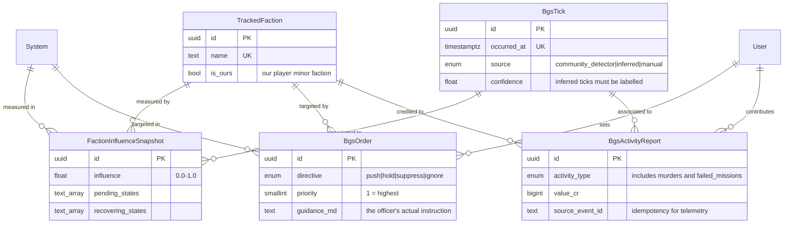
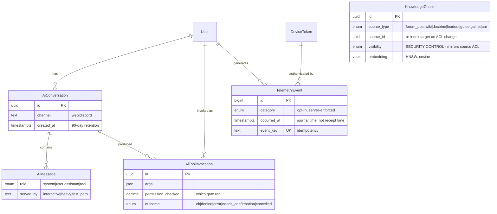
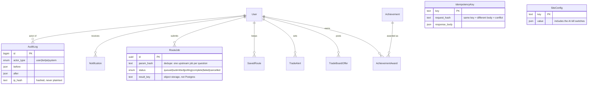

# ENTITY RELATIONSHIP DIAGRAMS

Split by domain — one diagram of 54 models is unreadable. `User` and `System` appear in several diagrams because they are the two hubs.

Authoritative field lists are in `schema.prisma`. These show *shape and direction*, with only the keys and the fields that carry meaning.

---

## Identity & authorization

**Effective permission mask = OR(Role.perm_mask for each UserRole) AND NOT User.deny_mask.** Nothing else grants (INV-001).

---

## Forum & recruitment

**Every read of a thread or post is filtered by its category's `view_perm` in the data layer, not the controller** (INV-002).

---

## Game data — our EDDN mirror

`MarketHistory` has no foreign keys by design — it is a high-volume append-only series, and FK checks on every insert would slow the collector's batch writes.

---

## Fleet, loadouts & operations

---

## BGS

**`FactionInfluenceSnapshot` is unique on `(faction, system, tick)`** — plus a partial unique index for the NULL-tick case. Multiple EDDN reports of one tick deduplicate; they are never summed (INV-019). Getting this wrong corrupts every chart and every officer decision downstream.

---

## AI & telemetry

**`KnowledgeChunk` has no foreign key to its source** — sources are polymorphic across seven types. That makes the re-index-on-ACL-change job (INV-003) a *hand-written correctness obligation* rather than something the database enforces, which is exactly why it has a dedicated test and a tier-3 risk classification.

**`AiToolInvocation` rows are written for denials too.** A `denied` row is the evidence the boundary held, not an error to suppress (INV-009).

---

## Cross-cutting

`AuditLog` is append-only. `IdempotencyKey` and `SiteConfig` have no relations by design — they are infrastructure, not domain.
